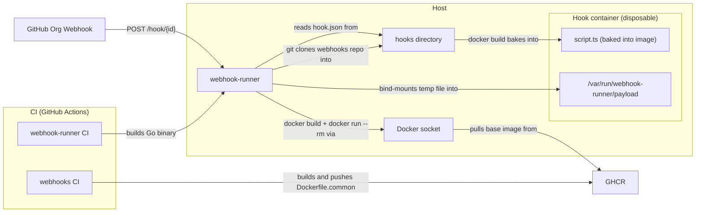

# webhook-runner

A self-contained Go HTTP server that executes incoming webhooks inside
disposable Docker containers. Each webhook is described by a `hook.json`
file in its own folder; the server watches the directory and hot-reloads
hooks without restart.

## Architecture



## Features

- **Folder-per-hook config**, parsed with JSONC-style comments.
- **Three authentication methods**: API key (recommended), Ed25519 public
  key signatures, and legacy HMAC-SHA256. At most one per hook.
- **Disposable containers**: every run is `docker run --rm ...` with the
  request body and headers bind-mounted as files.
- **Hot reload**: filesystem watch picks up new, modified, and removed
  `hook.json` files immediately.
- **Separate hook and admin ports**: the hook port (`:9000`) handles
  incoming webhooks and can be exposed publicly; the admin port (`:9001`)
  serves the dashboard, hook list, and run history and should be placed
  behind authentication (e.g. Cloudflare Zero Trust).
- **Stateful hooks (KV store)**: a hook can opt into a small persistent
  key/value store with `"state": true` — making webhook-runner almost a
  simple serverless platform. The hook reaches it at a plain
  `http://localhost:9002` URL (`HOOK_KV_URL`) with a scoped `HOOK_KV_TOKEN` —
  any HTTP client, no networking (webhook-runner injects a proxy shim that
  bridges that port to an internal Unix socket). get/put/delete/list, atomic
  increment, per-key TTL, and run-owned cooperative locks (acquire/release,
  auto-freed when the holding run ends). Data is disk-backed (survives
  restarts), bounded, and isolated per hook.
- **Git-backed hooks with CI-gated reloads**: point at a Git repository
  with `WEBHOOK_RUNNER_HOOKS_REPO` and the server clones it on startup.
  Configure the repo's GitHub webhook (push **and** status events) to
  `POST /_reload`: a push is recorded, but the working tree only switches
  to a commit once GitHub reports a successful gating commit status
  (`all-builds` by default) for it — the runner never reloads onto a
  commit with failing CI, and keeps serving the last green one. An hourly
  reconciliation poll backstops missed status webhooks (green-only, same
  ordering rules), so a dropped delivery costs latency, never a frozen
  deploy. See [CI-gated reloads](#ci-gated-reloads).
- **GitHub commit status integration**: optional per-hook; posts
  `pending` on start and `success`/`failure`/`error` on exit.
- **Sync and async invocation**: every hook returns a unique 128-bit
  run ID; clients can poll `GET /runs/{id}` or use `?wait=true` to block
  on the response.
- **Cancellation**: `POST /hook/{id}/cancel/{run}` kills an in-flight
  run's container (authenticated like the hook itself), so async callers
  can supersede stale work.
- **Activity-based timeout**: `timeout` kills a run only after it has
  produced no output for that long (any output byte resets the clock) —
  so long-but-chatty work survives while hung work is reaped. See
  [Timeouts](#timeouts).
- **First-class waits**: a state hook that wants to pause declares it —
  `POST /wait {"seconds": N, "reason": "..."}` on its state API blocks
  server-side, shows live on the dashboard as `waiting Ns: reason`, and
  counts as **activity** for the idle `timeout` — so hooks just sleep
  in-process instead of deferring work to a later run. See
  [Timeouts](#timeouts). Lock contention gets the same treatment: a
  contended acquire names its holder, can block (`{"block": true}`,
  equally watchdog-safe, shown as *waiting on lock … held by …* with the
  holder's runs listing their waiters), and `steal` hands the lock to the
  caller while cancelling the displaced run.
- **Spawn**: a [manager](#managers-persistent-watchers) starts runs of
  another hook through the runner itself (`POST /spawn` on its state
  API) — normal, tracked, concurrency-gated runs attributed to their
  parent. Authorized deny-by-default by the caller's own manager.json
  `spawn_targets` manifest — a hooks-repo declaration, never server env.
  See the [State KV API](#state-kv-api-httplocalhost9002-in-state-hooks).
- **Managers**: persistent, single-instance watchers as a first-class
  sibling entity to hooks — ONE supervised long-lived container each
  (flat restart forever, kernel-flock single-instance lease), fed by an
  inbox instead of per-delivery boots, with the full hook feature set.
  Enabled by default; declared under `src/managers/`. See
  [Managers](#managers-persistent-watchers).
- **Lock pinning**: a lock holder can flip its lock not-stealable and
  back (`POST /kv/{key}/pin`/`/unpin`, or acquire with `"pinned": true`)
  to protect a short critical section from latest-event-wins steals —
  refused steals name the pinned holder; a pin never outlives its run.
- **Declarative skips**: `skip_if` conditions over the request headers and
  parsed JSON payload answer unwanted-but-unmutable deliveries (e.g. a
  GitHub event type bundled into a checkbox you need for another event)
  immediately, with **no container booted** — recorded as first-class
  `skipped` runs naming the matched condition, visible on the dashboard
  and counted in their own stats bucket. See
  [Skip conditions](#skip-conditions-skip_if).
- **Friendly run titles**: a `run_title` template turns the dashboard's
  opaque run ids into subjects — `"{{repository.full_name}}#{{pull_request.number}}"`
  shows `wow-look-at-my/go-toolchain#47` on run rows, timeline chips, and
  the activity feed. Placeholders use `skip_if`'s exact payload/header
  addressing, degrade gracefully (no resolvable fields = no title, id
  fallback), title skipped runs too, and a state hook whose subject is
  only known mid-run can rename itself via `POST /title`. See
  [Run titles](#run-titles-run_title).
- **Immutable hook code**: every hook ships a `Dockerfile` next to its
  `hook.json` and runs an image webhook-runner builds from the hook
  directory, tagged by content hash — code is baked in, a hooks-repo pull
  can't change an in-flight run, and runs are plain
  `docker run --rm <image>`.
- **Hooks ship their own tests**: a `tests` array in `hook.json` declares
  test commands; `webhook-runner test <hooks-dir>` runs each one in the
  hook's built image, so CI never hardcodes per-hook test invocations.
- **Docker-in-Docker**: a hook can opt into `"dind": true` to run its own
  nested container daemon — the runner starts its container with
  `--privileged` plus an anonymous `/var/lib/docker` volume, fully isolated
  from the host's daemon (no host docker socket is ever mounted). The same
  two flags apply on the `webhook-runner test` path. `--privileged` is
  host-root-equivalent, so enable it only for trusted, operator-curated
  hooks. See [Docker-in-Docker](#docker-in-docker-dind).
- **Secrets without plaintext**: `env` values and `api_key` may reference
  secrets as `${NAME}`, resolved from a per-hook sops-encrypted file
  committed to the hooks repo (`secrets.sops.env`) or from the runner
  host's environment.
- **Scheduled hooks**: a `"schedule"` interval (a Go duration) fires a hook
  on a timer through the same run pipeline as an HTTP trigger, with
  skip-if-already-running overlap protection and fire-on-startup. See
  [Scheduled hooks](#scheduled-hooks).
- **Concurrency**: no global queue, each request fires its own container.
- **Operator kill switch**: disable any hook from the dashboard — deliveries
  are rejected with a loud `503` and scheduled runs are skipped until it is
  re-enabled — and override any concurrency group's limit live (declared vs
  effective always visible). Both are operational state persisted under the
  data dir: they survive restarts **and** hooks-repo reloads, and every flip
  is an activity event. See
  [Operational overrides](#operational-overrides-the-kill-switch).
- **Needs attention**: a persistent, impossible-to-miss misconfiguration
  surface. `GET /attention` (admin port) aggregates every ACTIVE problem —
  hooks dropped at load/validation (with the reason), unresolvable
  `${NAME}` `api_key`/`env` references, sops decrypt failures, the
  zero-hooks guard, the containerized-without-TMPDIR hazard, and
  recognized event-derived problems (a delivery denied over a broken
  api_key reference; a seam for future hook-emitted signals) — each with
  what's wrong and since when. The dashboard pins a red banner above both
  views whenever the count is non-zero and lists the entries in a "Needs
  attention" panel. Entries **clear themselves when the underlying state
  resolves**: the state-derived ones re-derive on every hooks reload (fix
  the config, reload, entry gone), only the TMPDIR verdict needs a
  restart. No acknowledgement, no dismissal — the panel is empty exactly
  when nothing is wrong.
- **Dashboard**: HTML view at `/` on the admin port showing the
  full internal state — loaded hooks, per-hook image status (built /
  will-build-next-run, images on disk), runs, and a live activity
  feed (GitHub push webhooks received, git pulls, reloads, load errors,
  image builds, run lifecycle — and rejected requests: unknown hook ids,
  denied auth, unresolvable `${NAME}` references in `api_key`/`env`, so
  "did you receive anything?" always has an answer). One-time setup
  instructions stay collapsed. The **primary runs view is a realtime
  swimlane timeline** (a canvas `<timeline-view>`, one lane per hook with
  a stable hue per hook): each run's queue wait draws as a dim lead-in
  ahead of its processing time, and declared waits, blocked lock
  acquires, and queued group acquires hatch. Waits are indicated ON the
  spans (no connector lines): a queued run's label carries the group and
  its live place in line ("⧗ model-gateway · 3rd", counting down as the
  queue advances), a run that others wait on carries "⏳N", and the run
  modal links holders and waiters for click-through; the chart's "?"
  legend explains both badges, and run tooltips spell them out in plain
  language ("waiting for model-gateway · 3rd in line", "holds the
  model-gateway slot · 2 waiting"). Failures are
  unmissable, cancelled runs render
  hollow with a dashed border and a marked kill tail, and instant runs
  become diamond pips — overlapping pips cluster into ×N markers that
  split apart as you zoom in. It follows "now" live;
  wheel/drag pans, ctrl/cmd+wheel (or pinch) zooms, and dragging into the
  past auto-loads history via `/runs?before=` until retention runs out;
  live run updates arrive over `/runs/stream` (SSE), and the same single
  connection carries coarse `changed` signals for every other section
  (hooks, images, concurrency, kv, activity feed) — **an idle dashboard
  makes zero requests of any kind**, sections update at push latency, and
  a broken stream degrades every feed to a gentle fixed 5s poll until it
  reconnects
  (an explicit "history ends here" boundary). Clicking a bar opens the
  run's output modal, clicking a lane label opens that hook's page, and
  the classic runs table stays available behind a "Show table" toggle.
  Opening a run shows its output with a
  per-line timestamp column (the raw view) or per-turn times (the
  conversation view), plus a **Copy log** button that puts the whole
  timestamped log on the clipboard. Every hook also has its own
  drill-down page (`/#hook={id}`, linked from the hooks list) with its
  config summary, run stats, image state, runs, activity slice, and —
  for `state: true` hooks — a **State (KV)** section listing the hook's
  stored keys (size, TTL remaining) where clicking a key shows its
  stored value (pretty-printed when it's JSON) — a per-"app" view,
  where an app is one hook for now. Run timing is split
  into queue wait and processing time: the runs table shows when a run
  was queued, how long it **Waited** for its concurrency slot, and a
  **Duration** that covers container time only, and the stats keep
  avg/max wait separate from avg/max duration.
- **Persistent run history**: completed runs are written once, at their
  terminal status, to a single bbolt file under the data dir; `/runs`,
  `/runs/{id}`, and the drill-down stats serve the live tracker merged
  with that history, so runs and their output survive restarts.
  Time-based retention (default 48h, `WEBHOOK_RUNNER_RUN_RETENTION`)
  with a per-hook count cap as a disk safety net
  (`WEBHOOK_RUNNER_RUN_RETENTION_MAX`). Runs still in flight during a
  restart never completed and are not in the store.
- **Static binary, alpine runtime image** with `docker-cli` and `git`
  for shelling out — no Docker SDK dependency.

## Quick start

```sh
# Build
go-toolchain
./webhook-runner ./examples/hooks

# Or with the bundled image
docker build -t webhook-runner .
docker run --rm \
  -p 9000:9000 -p 9001:9001 \
  -v /var/run/docker.sock:/var/run/docker.sock \
  -v $PWD/examples/hooks:/hooks:ro \
  webhook-runner /hooks

# Or with a private Git-backed hooks repo
# On first run, webhook-runner generates an SSH deploy key and prints
# the public key to logs. Add it to your repo's deploy keys, then restart.
docker run --rm \
  -p 9000:9000 -p 9001:9001 \
  -v /var/run/docker.sock:/var/run/docker.sock \
  -v webhook-runner-data:/var/lib/webhook-runner \
  -e WEBHOOK_RUNNER_HOOKS_REPO=git@github.com:you/your-private-hooks.git \
  -e WEBHOOK_RUNNER_HOOKS_REPO_SECRET=your-webhook-secret \
  webhook-runner
```

Then trigger a hook:

```sh
curl -X POST -d '{"foo":"bar"}' http://localhost:9000/hook/deploy-frontend
# { "run_id": "abqkr2f6mfjrtgsihpnz5rdgye" }

# Runs and dashboard are on the admin port
curl http://localhost:9001/runs/abqkr2f6mfjrtgsihpnz5rdgye
```

## HTTP API

The server listens on two TCP ports. The **hook port** (default `:9000`) should
be publicly accessible (e.g. via a Cloudflare Tunnel). The **admin port**
(default `:9001`) should be behind authentication (e.g. Cloudflare Zero Trust).
The per-hook KV store is reached by hooks at a plain `http://localhost:9002`
URL (backed by an internal Unix socket; see below), not a public port.

### Hook port (`:9000`)

| Method | Path                | Purpose                                    |
|--------|---------------------|--------------------------------------------|
| GET    | `/health`           | Liveness probe (200). Body carries the build version: `{"status":"ok","version":"..."}`. |
| GET    | `/version`          | Build identity + served hooks tree: `{"version","revision","time","hooks_tree"}` — the same string `webhook-runner version` prints (plus the VCS commit/time when the build has them), and the reload gate's tree state: `hooks_tree.state` is `serving` (tree at `serving_sha`; `verified` says a gating green vouched for it), `held` (adds `pending_sha`, `pending_state`, and a rendered `reason` like `awaiting all-builds` / `all-builds failure` while the gate holds a newer commit), `unknown` (gate tracking but no serving commit recorded — `serving_sha` omitted, never an empty string), or `untracked` (`mode` names why: no hooks repo, or the CI gate disabled). Deliberately public: the hook port reveals the deployed hooks-tree commit sha. |
| POST   | `/hook/{id}`        | Trigger a hook. Body becomes `HOOK_PAYLOAD_FILE`. `503 {"error":"hook disabled by operator"}` while the hook's [kill switch](#operational-overrides-the-kill-switch) is flipped. An authenticated delivery matching a [`skip_if` condition](#skip-conditions-skip_if) answers immediately (sync hooks included) with `200 {"run_id","status":"skipped","reason"}` and boots no container. |
| POST   | `/hook/{id}/cancel/{run}` | Cancel an in-flight run of this hook (same auth as triggering it). Works for disabled hooks too — cancelling is stopping work. |
| POST   | `/_reload`          | The hooks repo's GitHub webhook endpoint (HMAC auth, requires `WEBHOOK_RUNNER_HOOKS_REPO_SECRET`). Event-aware: a `push` fetches and records the new tip as pending (`200 {"status":"held"}`); a `status` event for the gating context with state `success` is what switches the tree and reloads (`{"status":"reloaded"}`); other events answer `ignored`. See [CI-gated reloads](#ci-gated-reloads). With the gate disabled (env set empty), any signed POST pulls + reloads (legacy). |

### Admin port (`:9001`)

| Method | Path                | Purpose                                    |
|--------|---------------------|--------------------------------------------|
| GET    | `/health`           | Liveness probe (200). Body carries the build version. |
| GET    | `/version`          | Build identity + `hooks_tree` state (same shape as on the hook port). The dashboard footer shows the build string. |
| GET    | `/hooks`            | List loaded hooks (id + description + `disabled`, the **effective** kill-switch state: the operator's persisted override when one exists, else the hook.json [`enable` default](#operational-overrides-the-kill-switch) — a disabled hook stays loaded and listed). |
| GET    | `/hooks/{id}`       | One hook's drill-down: a value-free config summary (schedule, concurrency group, state on/off, timeout, whether an api_key is configured as a boolean, env var *names* — never key material or env values), the operator kill-switch state (`disabled`), its image state, its KV namespace stats, and run stats (counts by status, success rate, avg/max **processing** duration and avg/max **queue wait** — kept separate, see `/runs` — plus last run) over the live window merged with the persisted run history (`stats.retention` names the window, e.g. `48h`). |
| POST   | `/hooks/{id}/disable` | Flip a hook's [kill switch](#operational-overrides-the-kill-switch) off: deliveries are rejected (`503`) and scheduled runs skipped until re-enabled. Writes an **explicit persisted override** that outranks the hook.json `enable` default; idempotent; `404` for unknown hooks; persisted before the response (a persist failure is a loud `500` with nothing half-applied). |
| POST   | `/hooks/{id}/enable`  | Flip it back on — an explicit override too, so it also wins over a hook shipping `"enable": false`. Idempotent; `404` for unknown hooks. |
| POST   | `/hook/{id}`        | Trigger a hook (also available here; a disabled hook is `503` here too — re-enable it to run it). |
| POST   | `/hook/{id}/cancel/{run}` | Cancel a run (also available here).  |
| GET    | `/runs`             | Runs across all hooks, newest-first: live (active + recent) merged with the persisted completed history, deduped by run ID; `?hook={id}` narrows to one hook, `?max=` caps the page (default 100). `?before=<RFC3339 timestamp>` (fractional seconds optional) pages into history: only runs queued **strictly before** that instant — pass the oldest `started` you already hold as the next cursor, so consecutive pages tile with no gap or overlap (a malformed value is a `400`; omitted means unpaged). Each run carries `started` (when it was accepted/queued) and, separately, `started_at` (when its container actually launched — absent while pending, or if it never started), so queue wait (`started`→`started_at`) and processing time (`started_at`→`finished`) never blur together. A run queued on a concurrency group carries `waiting_on` `{kind: "group", key: <group>, holder_run_ids, position}` (position is 1-based; holders re-stamped live), and each slot HOLDER lists the queued runs in `waiters` with `key: "group:<name>"` — same derived mechanics as lock waits. |
| GET    | `/runs/{id}`        | Status + retained output for one run — served from the live tracker, falling back to the persisted history for runs evicted from it or finished before a restart. |
| POST   | `/runs/{id}/cancel` | Cancel any run (no auth — admin port is trusted). |
| GET    | `/runs/stream`      | **Server-Sent Events live tail** of run lifecycle — and the whole dashboard's push channel. On connect: a `retry: 2000` directive (fixed client reconnect delay), then one `snapshot` event (the current live+recent runs — same shape as `/runs`, output stripped), then one `run` event per lifecycle change (created/queued, pending→running, waiting_on set/cleared, title set, cancel requested, terminal with exit/error), plus a heartbeat every ~10s (an SSE comment for proxies AND an `hb` event the client can key freshness off). The same connection multiplexes `changed` events — `{"sections":["hooks","kv",...]}` — coarse "these admin sections changed, refetch each once" signals covering `/hooks`, `/images`, `/concurrency`, `/kv`, `/events`, `/attention`, and the `/reload/status` panel (fed by hook reloads, kill-switch flips, image builds, limit overrides, kv writes, run lifecycle, every activity event, attention-set changes, and reload-gate/git/push events). Signals are a coalescing dirty-set per client: a burst folds into one event, and signals can never drop a client. Fan-out never blocks run execution: each client has a bounded run-delta buffer and a client that can't keep up is **dropped** — its EventSource reconnects, resyncs from the fresh connect snapshot, and refetches every section once (signals carry no payload, so none are load-bearing). This is what lets an idle dashboard make zero requests of any kind. |
| POST   | `/reload`           | Pull hooks repo to its tip and reload (no auth — admin port is trusted). With the [CI gate](#ci-gated-reloads) on, this is the operator's **deliberate bypass**: it force-switches to the remote tip and records it verified. |
| GET    | `/reload/status`    | The dashboard reload panel's snapshot: `mode` (`gated`/`legacy`/`none` — `none` when no hooks repo is configured), `hooks_branch`, `gate_context` + `verified` (gated only), the `live` commit (`{sha, short, subject, date, ci_state, has_src, is_live}` — `ci_state` is the gating context's state, `unknown` whenever it cannot be read, `none` when CI has not reported; `has_src` = the commit's **tree** contains `src/hooks`, checked with git plumbing, never a checkout), and `pending` (the gate's held tip, with `state` + a human `why`) when one exists. Cheap by design: no git fetch, one cached CI lookup. |
| GET    | `/reload/commits`   | Recent origin history for the picker: fetches the tracked branch fresh, then lists ~20 commits, each in the same shape as `live` above (plus `is_live` on the serving one). CI lookups are cached and share a bounded budget — commits past it read `unknown` rather than stalling the listing. |
| POST   | `/reload/check`     | **Reload on demand.** Gated mode runs one pass of the existing reconcile logic (fetch the tip; switch only on an affirmative green; hold loudly otherwise) and reports `{"mode":"gated","outcome":...}` — `switched`, `already-current`, `held-red`, `held-pending`, `held-blind`, `ignored-stale`, `fetch-failed`, `switch-failed`. Legacy mode runs the verbatim pull+reload (`{"status":"reloaded"}`). |
| POST   | `/reload/switch`    | **Manual commit pick**, body `{"ref": "<sha-or-branch>", "override": false\|true}` — see [CI-gated reloads](#ci-gated-reloads). Resolves the ref (fetching from origin as needed; `400` for an unresolvable one), evaluates its gating CI state and `src/hooks` tree marker, and: green + src present → switches (`reload.switched`); anything else **without** `override` → `409` `{"error", "requires_override": true, "reasons": [...], "commit": {...}}` naming every failed check, nothing moves; **with** `override: true` → switches anyway, loudly (`reload.forced` names each overridden reason). Routed through the gate's Force-style apply path, so rollback to an **older** commit works and a wedged gate (unreadable CI) stays overridable. `409` in legacy mode (per-commit switching needs the gate). |
| GET    | `/config`           | Dashboard setup info: `hooks_repo`, `hook_base_url`, `reload_secret` (each only when set), plus `run_retention` — the persisted run-history window as a compact duration (e.g. `48h`), i.e. how far back `/runs?before=` paging can ever reach — present only when the run store is configured. |
| GET    | `/events`           | Activity feed: GitHub push webhooks, git pulls, reload-gate verdicts (`reload.held`, `reload.held_red`, `reload.switched`, `reload.verified`, `reload.unverified`, `reload.ignored_stale`, `reload.forced`, `reload.poll_blind`, plus the manual panel's `reload.check` and `reload.switch_refused` — see [CI-gated reloads](#ci-gated-reloads)), hook (re)loads and load errors, image builds, run lifecycle (including `run.queued` when a run waits for a concurrency slot), rejected requests (`hook.unknown`, `hook.denied`, `hook.misconfigured`, `hook.disabled_rejected`), unresolved env references (`env.unresolved`), and every operator kill-switch flip (`hook.disabled`, `hook.enabled`, `concurrency.overridden`, `concurrency.override_cleared`, `override.orphaned`, `override.write_failed`). Newest first; `?max=` caps it, `?hook={id}` narrows to one hook's slice. |
| GET    | `/attention`        | The **needs-attention** problem set: `{count, entries}` where each entry is `{source, hook, key, message, since}`, oldest first. Sources: `load` (hook dropped at load/validation — the reason quoted), `zero-hooks` (nothing loaded at all), `secrets` (unresolvable `${NAME}` `api_key`/`env` references or a failing sops decrypt, statically re-probed on every reload), `server` (the containerized-without-TMPDIR hazard — boot-scoped, needs a restart to clear), `event` (derived from recognized activity events: today a delivery denied over a broken api_key reference; reserved kinds `hook.reported_misconfigured`/`hook.reported_healthy` are the seam for future hook-emitted signals). Entries are value-free (they name references, never resolved values) and **self-clearing**: state-derived ones vanish on the reload that fixes them, the event-derived api_key one when a reload's probe finds the reference resolvable (or the hook is removed), reported ones on the hook's paired all-clear event. `since` = when the problem first became active (stable while it persists; in-memory, so a restart re-derives state entries at boot). Entries of hooks that are **effectively disabled** (operator override, or an `"enable": false` default) are filtered out at read time — an off hook's failures are moot — and resurface the moment the hook is re-enabled. The dashboard's red banner + "Needs attention" panel render this. |
| GET    | `/images`           | Per-hook image state: the tag the current content resolves to, whether it's built (false = next run builds it), and every `whr-hook/*` image on disk. |
| GET    | `/concurrency`      | One document: `groups` — every declared concurrency group's live state: its **effective** `limit`, the `declared` limit from concurrency.json, an `overridden` flag when the two differ because of an operator override, how many runs are `active`, and how many are `waiting` (queued) behind it — plus the queue drill-down: `holders` (the runs occupying the slots, in acquire order) and `waiting_runs` (the queue, in order), each entry a `{run_id, hook_id, title, status, since, started, started_at}` enriched from the live tracker (an evicted run keeps its `run_id`/`since`). And `global` — the [global run cap](#the-global-run-cap)'s state in the same shape (`limit`, `default`, `overridden`, `active`, `waiting`, `holders`, `waiting_runs`). The dashboard renders both as expandable rows: one click from a saturated group (or the cap) to any holder's or waiter's run modal. |
| PUT    | `/concurrency/{group}/limit` | Override a group's limit live: body `{"limit": N}`, `N >= 1` (`0` is rejected — it would deadlock queued runs; to stop a group's hooks entirely, disable the hooks). `404` for undeclared groups. The swap is safe with runs in flight, and the override survives reloads and restarts until deleted. |
| DELETE | `/concurrency/{group}/limit` | Remove the override; the declared limit takes effect again. Idempotent; also accepts a group that is no longer declared but still has a stored (orphaned) override. |
| PUT    | `/concurrency-global/limit` | Override the [global run cap](#the-global-run-cap) live: body `{"limit": N}`, `N >= 1` (`0` is rejected — it would block every run on the server). A dedicated path — deliberately not `/concurrency/{group}/…` — so it can never collide with a declared group name. Persisted (survives restarts) and applied to already-queued runs immediately. |
| DELETE | `/concurrency-global/limit` | Remove the cap override; the `WEBHOOK_RUNNER_MAX_CONCURRENT_RUNS` / built-in default (64) takes effect again. Idempotent. |
| GET    | `/kv`               | Read-only state-store stats: per-namespace key count and byte total (no values at this level; shape unchanged for existing consumers). |
| GET    | `/kv/{namespace}`   | List one namespace's keys (namespace == hook ID): per key its name, value size in bytes, and — when a TTL is set — `expires_at` (absolute) plus `ttl_seconds` (remaining); both absent for keys without a TTL. Sorted by key; `?prefix=` filters. Unknown/empty namespaces list as empty. |
| GET    | `/kv/{namespace}/{key}` | Read one entry: the metadata above **plus the stored value** — `value_base64` always, `value_utf8` additionally when the bytes are valid UTF-8. `404` when absent **or expired** (the same lazy-expiry rule the state API applies). The key is one path segment: URL-encode it (`%2F` for `/`, `%23` for `#`). |
| GET    | `/managers`         | The [manager](#managers-persistent-watchers) roster: per manager its state (`running`/`starting`/`restart-wait`/`stopping`/`disabled`/`waiting-lease`), effective `disabled`, live `instance_id` + `instance_started`, restarts since boot, inbox depth, last delivery/tick, and config summary (reconcile interval, sync, group). Empty list when none are declared. |
| GET    | `/managers/{id}`    | One manager's drill-down: the roster row plus the live instance's recent `output` lines — managers are NOT runs, so their logs live here, never in `/runs`. |
| POST   | `/managers/{id}/disable` | The manager [kill switch](#operational-overrides-the-kill-switch) (same persisted overrides store as hooks; ids share one namespace): gracefully stops the live instance and parks the supervisor loop; deliveries are `503` until re-enabled. An **emergency control** — managers default enabled. |
| POST   | `/managers/{id}/enable`  | Flip it back: the supervisor starts a fresh instance. Both flips are idempotent, `404` for unknown managers. |
| POST   | `/managers/{id}/restart` | Bounce the live instance: graceful stop, then the supervisor's normal loop starts a fresh one (fresh instance id, orphan reap first). `409` when disabled or no instance is live. |
| GET    | `/`                 | Dashboard. A persistent sidebar routes every section as its own page (`/#page=hooks`, `#page=managers`, `#page=runs`, …; the bare `#` is the chart-first overview); `/#hook={id}` opens a hook's drill-down, `/#manager={id}` a manager's. |

The dashboard's static assets are content-addressed: the served index.html
references `/dashboard.<hash>.css|.js` and `/timeline.<hash>.js` (hash of the
embedded bytes), which are cacheable forever (`Cache-Control: immutable` +
ETag) — a new build changes the URLs. `/`, the bare
`/dashboard.css|.js`/`/timeline.js` paths, and any stale-hash URL (404) are
`no-cache`, so an edge cache (e.g. Cloudflare, which caches `.css`/`.js` by
extension when the origin sends no cache headers) can never pair a new
index.html with stale assets after a deploy. `timeline.js` is **generated**
(TypeScript compiled by ts0 — see
[Dashboard TypeScript](#dashboard-typescript)) but committed, and the
committed bundle is authoritative: `go:embed` ships it as-is, and the build
needs no Node toolchain.

### State KV API (`http://localhost:9002` in state hooks)

The per-hook KV store, consumed by hook containers at a plain
`http://localhost:9002` URL (`HOOK_KV_URL`). There is no network and no public
port: webhook-runner serves the API on an internal Unix socket and injects a
tiny proxy shim as the hook's entrypoint that bridges `localhost:9002` to it
(see *Stateful hooks* below). Every request carries the bearer token the runner
injects as `HOOK_KV_TOKEN` (`Authorization: Bearer <token>`); the namespace is
derived from the token, never from the URL, so a hook can only ever reach its
own data.

| Method | Path             | Purpose                                                        |
|--------|------------------|----------------------------------------------------------------|
| GET    | `/kv/{key}`      | Read a value (`200` raw bytes, `404` if absent/expired).       |
| PUT    | `/kv/{key}`      | Store a value (body = raw bytes). Optional TTL via `X-KV-TTL: <seconds>` header or `?ttl=<seconds>`. `204` on success, `413` over the value cap. |
| DELETE | `/kv/{key}`      | Remove a key (idempotent `204`).                               |
| GET    | `/kv`            | List the caller's keys: `{"keys":[...]}` (sorted, non-expired). |
| POST   | `/kv/{key}/incr` | Atomically add to an integer counter. Optional body `{"delta":N}` (default `+1`) and TTL as for PUT. Returns `{"value":<int64>}`; `409` if the existing value isn't an integer. |
| POST   | `/kv/{key}/acquire` | Take the cooperative lock named `{key}`, owned by the **calling run** (the identity in the token — no client-side owner tokens). `200` `{"run_id","hook_id","acquired_at","expires_at"}` when this run took or already held it (idempotent); `409` when another live run holds it — **naming the holder** in `held_by` (`{"run_id","hook_id","acquired_at","expires_at"}`), so contention is actionable: display it, keep waiting, or steal (nothing is mutated by a contended try). Optional body `{"ttl_seconds": 1..3600}` sets the secondary backstop expiry (default 15m). **Blocking**: add `{"block": true}` (+ optional `"block_timeout_seconds"` 1..600, default 600) and a contended acquire is HELD until the lock is taken (`200`), the timeout passes (`409` + `held_by`), or the run ends. While blocked, the run shows as *waiting on lock `{key}` held by …* on the dashboard and the hold **counts as activity** for the idle `timeout` — same protection as `/wait`. Fairness is best-effort (waiters poll every ~250ms; no FIFO queue). The **primary** release is automatic: when the holding run finishes — success, error, timeout, or cancel — the runner frees all its locks. Locks are in-memory (a restart starts lock-free; no run survives a restart anyway) and separate from stored values: GET/PUT/DELETE on the same key touch the value, never the lock. |
| POST   | `/kv/{key}/release` | Release early, before the run ends (optional hygiene). `204` released; `404` not held (absent or expired); `409` held by a different run — ownership is verified server-side from the token. |
| POST   | `/kv/{key}/pin`  | **Make the held lock not-stealable.** Owner-only (`409` held by another run, `404` not held), idempotent `200` with the lock info (`"pinned": true`). While pinned, `steal` is refused with `409` + the pinned holder in `held_by` (and a `lock.steal_refused` event) — contenders fall back to waiting/blocking, which still wins the lock on release. The pin protects a short critical section (e.g. push→verify→arm) from latest-event-wins displacement; it dies with the run like the lock itself (finish-seam release + TTL backstop unchanged). Acquire can also take-and-pin atomically: `{"pinned": true}` on `/kv/{key}/acquire` (honored on the blocking path too). |
| POST   | `/kv/{key}/unpin` | Flip it back stealable. Owner-only, idempotent `200`. |
| POST   | `/inbox/next`    | **Managers only** ([Managers](#managers-persistent-watchers)): long-poll the manager's inbox. Body `{"wait_seconds": 1..600}` (optional; default 60). `200` = one event `{"id","kind":"delivery"\|"tick"\|"start","received_at","headers","payload"}`; `204` = nothing arrived within the wait; `409` = the token's instance is no longer the live one (a superseded instance must exit, not consume). Calling it again acknowledges the previous event as processed (settling any [`synchronous`](#managers-persistent-watchers) delivery hold and `github_status` for it). Hooks `404` here. |
| POST   | `/kv/{key}/steal` | **Destructively take the lock**: atomically transfer it to the calling run AND cancel the displaced holder (the existing cancel path kills its container; its terminal error reads `cancelled: lock "{key}" stolen by run …`, and its *other* locks release normally on finish — the stolen one is already the thief's). `200` `{"run_id","hook_id","acquired_at","expires_at","stolen_from":{"run_id","hook_id"}}`; `stolen_from` is absent when the lock was free — a steal of an uncontended lock is exactly an acquire, and a holder that finished first makes this a plain acquire (no error, race-safe). Namespace scoping means a run can only ever steal from — and cancel — runs of its **own** hook. Blocked waiters are not inherited: they keep polling, now against the new holder. Optional `{"ttl_seconds"}` as for acquire. |
| POST   | `/wait`          | **Declared sleep.** Body `{"seconds": 1..600, "reason": "..."}` — both required (a wait must be explained; one call caps at 10 minutes, loop for longer). Blocks ~`seconds`, then returns `200` `{"waited": N}`. While it blocks, the run row on the dashboard shows `waiting Ns: reason` and the wait **counts as activity for the idle `timeout`** — a declared in-process sleep can never be reaped as silence (see [Timeouts](#timeouts)). Returns early with `{"waited": M, "interrupted": true, "cause": "run finished"\|"run cancelled"}` when the run ends or a cancel is requested. `400` invalid body; `409` when the calling run is no longer active. |
| POST   | `/title`         | **Name the run mid-flight.** Body `{"title": "..."}` (trimmed, 1–200 characters). Sets the calling run's friendly display title — the live dashboard row, timeline chip, `/runs` JSON, and the persisted terminal snapshot all pick it up — replacing any [`run_title`](#run-titles-run_title) template title (last write wins). For runs whose subject is only known mid-run: a fleet sweep titles itself `sweep: owner/repo` once it knows which repo mattered. `204` on success; `400` empty/overlong; `409` when the calling run is no longer active. |
| POST   | `/spawn`         | **Start runs of ANOTHER hook through the runner** (built for coordinator [managers](#managers-persistent-watchers) — replaces POSTing HMAC-signed synthetic webhooks at the public endpoints). Body `{"hook":"<target id>","count":1..100,"payload":<JSON object, ≤256 KiB>}` + optional `"event":"<string>"` — the payload becomes each spawned run's `HOOK_PAYLOAD_FILE` verbatim, and `event` becomes their `X-GitHub-Event` header (hooks branch on it); every spawned run also gets `X-Webhook-Runner-Spawned-By` / `X-Webhook-Runner-Spawned-By-Run` headers naming the caller. Authorization is **manifest-sourced and deny-by-default**: the caller must be a [manager](#managers-persistent-watchers) whose own manager.json names the target in `spawn_targets` — never a hook.json field (hooks cannot spawn) and never server env (granting a spawn is a hooks-repo change deployed like any other declaration). Pre-validated all-or-nothing before anything starts: `400`/`413` bad body or bounds; `409` calling run/instance not active; `404` unknown target; `403` caller not a manager, or target not in its `spawn_targets`; `409` target disabled by the [kill switch](#operational-overrides-the-kill-switch) — each denial records a `spawn.denied` activity event. On success, `count` **normal runs** of the target start (tracked, gated by the target's [concurrency group](#concurrency-groups) — excess spawns queue as `pending` — KV-enabled, persisted) and the response is `200 {"run_ids":[...]}` in start order, immediately: dispatch is async, the caller never waits on slots. [`skip_if`](#skip-conditions-skip_if) is **bypassed** like scheduled fires (a spawn is operator machinery's own doing, not an unwanted delivery). Spawned runs carry `spawned_by {run_id,hook_id}` in their run JSON/history, and their `run.started` feed lines name the parent. Older runners `404` this route — deploy the runner before merging any manager that calls it, and treat `404`/`405` ("primitive unavailable") and `403` (no grant) as loud failures, never a silent skip. |

### Sync vs async

By default, `POST /hook/{id}` returns `202 Accepted` with `{"run_id": "..."}`
as soon as the container has been spawned. To block until the run finishes,
add `?wait=true`. Combine with `?timeout=30s` to cap how long the server
holds the connection (the run continues in the background if the sync
timeout elapses first).

A hook can opt into sync-by-default by setting `"synchronous": true`
in `hook.json`. The query parameter still wins.

### Cancelling a run

`POST /hook/{id}/cancel/{run}` asks the runner to kill an in-flight run's
container. It is authenticated exactly like triggering the hook (same
api_key / signature), and a hook's credentials can only cancel that hook's
own runs. Responses:

- `202` `{"run_id": "...", "status": "cancelling"}` — cancel requested; the
  run reaches status `cancelled` once the container is actually gone.
- `409` — the run already finished (body carries its final status).
- `404` — unknown hook or run (including runs belonging to another hook).

This is what lets a fire-and-forget caller supersede stale work: kick off a
run, remember the `run_id` from the 202, and cancel it if a newer event
makes its result obsolete (e.g. pr-minder cancelling an in-flight
PR-describe run when new commits arrive).

## Stateful hooks (KV store)

Hook containers are disposable and have no memory of their own. Set
`"state": true` in a hook's `hook.json` to give it a small persistent
key/value store — enough to count invocations, dedupe events, cache a token,
or carry anything else across runs. This is what makes webhook-runner almost
a simple serverless platform.

When a state hook runs, the runner injects two environment variables (and a
proxy shim as the container entrypoint that makes `localhost:9002` work):

- `HOOK_KV_URL` — base URL of the KV API (`http://localhost:9002`).
- `HOOK_KV_TOKEN` — a bearer token scoped to **this hook's** namespace.

The hook just makes plain HTTP calls with any client:

```sh
# Increment a counter and read the running total (atomic, race-free)
curl -fsS -XPOST -H "Authorization: Bearer $HOOK_KV_TOKEN" "$HOOK_KV_URL/kv/hits/incr"
# {"value":1}

# Put a value with a 1-hour TTL, then read it back
curl -fsS -XPUT -H "Authorization: Bearer $HOOK_KV_TOKEN" -H "X-KV-TTL: 3600" \
  --data-binary @- "$HOOK_KV_URL/kv/last-seen" <<<"$COMMIT_SHA"
curl -fsS -H "Authorization: Bearer $HOOK_KV_TOKEN" "$HOOK_KV_URL/kv/last-seen"
```

It's an ordinary HTTP endpoint, so any language's standard client works — no
Unix-socket support needed. (Under the hood, webhook-runner serves the API on
an internal Unix socket and sets its own binary as the hook's entrypoint to
proxy `localhost:9002` to it, then runs the hook's real command.)

Properties:

- **Durable**: data is written to `<data-dir>/kv/<hook-id>.json` (atomic
  temp+rename) and survives server restarts.
- **Isolated**: the namespace comes from the verified token, never the URL —
  a hook can only ever read and write its own data.
- **Internal**: no network and no published port — the API is an internal Unix
  socket reached only through the injected localhost proxy.
- **Bounded per item, not in total**: per-value size (64 KiB, oversize writes
  get `413`) and namespace-count (256) caps remain, but total KV growth is
  deliberately uncapped in-process — the backstop is a memory cap on the
  server's container (RAM always; swap only where the host kernel accounts
  it — see the compose example), which also bounds disk because the store is
  a full in-memory mirror of what it persists.
- **TTL**: any `PUT`/`incr` may set a per-key expiry (`X-KV-TTL` seconds or
  `?ttl=`); expired keys disappear from reads and are swept from disk.
- **Locks**: `acquire`/`release` give same-hook runs a race-free mutual
  exclusion primitive without any of the GET-then-PUT races a client-side
  lock would have. A lock belongs to the acquiring **run**, and the runner
  releases everything a run still holds the moment it terminates — for any
  reason — so a crashed or killed holder can never wedge a lock (a generous
  TTL backstop exists purely as a belt against bugs). Contention is
  **first-class**: a contended try names the holder (`held_by`),
  `{"block": true}` waits for the lock (watchdog-safe, dashboard-visible
  as *waiting on lock … held by …*, with the holder's runs showing who is
  waiting on them), and `steal` transfers the lock while cancelling the
  displaced run — the "newest run wins" primitive for superseding stale
  work.
- **Waits**: `POST /wait {"seconds": N, "reason": "..."}` is a first-class
  declared sleep — dashboard-visible and counted as activity for the idle
  `timeout` (see [Timeouts](#timeouts)) — so a state hook can pause
  in-process without being reaped for silence.

See the State KV API table above for the full endpoint list. On the admin
port, `GET /kv` shows per-hook key counts and byte totals, and the inspection
routes `GET /kv/{namespace}` / `GET /kv/{namespace}/{key}` list a hook's keys
(with sizes and TTLs) and read stored **values** — also surfaced on the
dashboard as a *State (KV)* section on each state hook's page (click a key to
view its value). Exposing values on the admin port is deliberate: whatever a
hook stores becomes readable there, so keep that port operator-only (Zero
Trust — the same trust the un-authenticated `/reload` and run cancellation
already assume). Values never appear on the public hook port, and
`/hooks/{id}` stays value-free.

> **Deploy-first:** `state` is a newer `hook.json` field, so deploy a
> webhook-runner build that understands it before any hook sets `"state":
> true` (older binaries reject unknown fields). The KV socket and the proxy
> shim live under `TMPDIR`, which must be host-shared when the server runs in
> a container — the same requirement payload files already have; see *Running
> the server in a container*.

## Docker-in-Docker (dind)

A hook that needs to run its own containers — build an image, spin up a
service, drive a nested `docker` CLI — can opt into Docker-in-Docker with
`"dind": true`:

```json
{
  "$schema": "https://sites.pazer.build/webhook-runner/branch/master/hook.schema.json",
  "dind": true
}
```

When set, the runner starts the hook's container with two extra flags,
applied identically on the **live-run** and **`webhook-runner test`** paths:

- `--privileged` — grants a nested `dockerd` the capabilities it needs.
- `--mount type=volume,dst=/var/lib/docker` — an anonymous volume for the
  inner daemon's storage.

The `/var/lib/docker` volume is **required**, not incidental: a nested
daemon's storage driver (overlay2) cannot stack its overlay filesystem on
top of the outer container's own overlay rootfs, so `/var/lib/docker` must
be a real volume rather than the layered container filesystem. Because every
run is `docker run --rm ...`, that anonymous volume is removed when the run
ends — inner image/layer storage never leaks between runs.

The host's own docker daemon is **never exposed**: webhook-runner does not
mount the host's docker socket, so the nested daemon is a fully isolated,
throwaway daemon rather than a window onto the host. Start it inside the
hook (e.g. `dockerd-entrypoint.sh dockerd &` on a `docker:dind` base image),
wait for `/var/run/docker.sock`, then drive it with the `docker` CLI. See
`e2e/hooks/dind-hook/` for a worked smoke test.

> **Security:** `--privileged` is effectively host-root — a privileged
> container can reach the host kernel. `dind` is therefore an audited,
> opt-in, per-hook capability; enable it only for **trusted,
> operator-curated** hooks (the hooks repo is operator-controlled). It is
> deliberately first-class rather than something assembled from
> `extra_docker_args`: those raw args are appended only on the live-run path
> (so they can never cover `webhook-runner test`) and would still leave you
> hand-writing the volume, whereas `dind` applies the exact same two flags to
> both paths and is auditable as a single boolean.

> **Deploy-first:** `dind` is a newer `hook.json` field, so deploy a
> webhook-runner build that understands it before any hook sets `"dind":
> true` (older binaries reject unknown fields via `DisallowUnknownFields`).

## Managers (persistent watchers)

Some workloads are not webhooks: they are persistent, single-instance
reconcilers (a coordinator dispatching CI runners, a PR minder). Running
those as hooks means one cold container per delivery and lock
choreography to fake single-instance-ness. A **manager** is the
first-class alternative: the runner supervises ONE long-lived container
for it, restarted on any exit after a flat 10s delay, forever.

Declare one under the src layout at `src/managers/<id>/manager.json` (+
the mandatory `Dockerfile`, code baked in — exactly the hook rules):

```jsonc
{
  "$schema": "https://sites.pazer.build/webhook-runner/branch/master/manager.schema.json",
  "description": "Reconcile queued CI jobs and spawn workers",
  "secret": "…",                 // the hook auth trio, verbatim
  "reconcile_interval": "3m",    // optional ticks; omit = event-only
  "timeout": "10m",              // wedge detection (see below)
  "spawn_targets": ["worker-hook"], // hooks this manager may /spawn
  "skip_if": [ { "header:x-github-event": { "ne": "workflow_job" } } ]
}
```

- **Deliveries feed an inbox, not containers**: `POST /hook/<id>` is
  authenticated and `skip_if`-filtered exactly like a hook, then the
  delivery lands in a bounded in-memory inbox (256; overflow drops
  oldest, loudly). The manager consumes it via long-poll `POST
  /inbox/next` on its [state API](#state-kv-api-httplocalhost9002-in-state-hooks).
- **Ticks are inbox events too**: with `reconcile_interval` set, the
  runner enqueues a coalesced `{"kind":"tick"}` on that flat cadence,
  plus a `start` event when an instance boots — the crash-recovery pass.
  Event-only managers (no interval) are first-class.
- **Single-instance, fleet-wide**: a kernel flock lease
  (`<data-dir>/managers.lock`) + deterministic container names
  (`webhook-runner-mgr-<id>`) + orphan `docker rm -f` on acquire make a
  second live instance impossible, across rolling deploys and crashes.
- **Instances are NOT runs**: nothing manager-shaped appears in `/runs`
  or on the timeline (a forever-running bar would drown real work). The
  manager's state, restarts, and live output live on
  [`GET /managers`](#admin-port-9001) and the dashboard's Managers page.
  Runs the manager dispatches via [`/spawn`](#state-kv-api-httplocalhost9002-in-state-hooks)
  are normal tracked runs.
- **Full hook feature set**, manager-shaped: `env`/secrets, `tests`,
  `script`/`command`, `concurrency_group` (the instance holds one slot
  for its lifetime), `run_title` (panel title; `POST /title` renames),
  `synchronous` (each delivery's response holds until the manager
  finishes that event), `github_status` (per-delivery statuses), `dind`.
  Only `state` (implied true) and `schedule` (superseded by
  `reconcile_interval`) are rejected.
- **`spawn_targets` = the spawn grant** (managers only): the hook ids
  this manager may start via
  [`POST /spawn`](#state-kv-api-httplocalhost9002-in-state-hooks),
  deny-by-default — absent or empty spawns nothing, and hooks can never
  spawn at all. Entries must name hooks declared in the same tree: an
  unknown id or a manager id fails load/`validate` and drops the
  manager. Granting a spawn is a hooks-repo change deployed like any
  other declaration, never server configuration.
- **`timeout` = wedge detection, not a lifetime**: the activity watchdog
  only arms while an event is checked out (or queued with nobody
  consuming); a manager parked in its long-poll with an empty inbox is
  healthy forever. A wedged instance is killed and restarted.
- **Enabled by default**: a declared manager works the moment it
  deploys. The dashboard's Managers page carries the same slider
  [kill switch](#operational-overrides-the-kill-switch) as hooks — an
  emergency stop (graceful; re-enable starts a fresh instance), plus a
  Restart bounce.
- **KV continuity**: namespace == manager id, so a hook migrated to a
  manager keeps all its stored state; locks (including
  [pinning](#state-kv-api-httplocalhost9002-in-state-hooks)) are held by
  the instance and released when it ends.

> **Deploy-first:** managers need a runner build with this support —
> older binaries never scan `src/managers/`, so deploy the runner before
> the first manager directory merges.

## hook.json reference

The full schema is published at
`https://sites.pazer.build/webhook-runner/branch/master/hook.schema.json`
(deployed to [buildhost](https://github.com/wow-look-at-my/buildhost) sites
on every master push by `.github/workflows/schemas.yml`; the legacy
`https://wow-look-at-my.github.io/webhook-runner/hook.schema.json` still
serves its frozen 2026-07-15 content and remains accepted in `$schema` —
the runner only requires the field's presence, never a specific URL).
See `examples/hooks/` for working examples.

Every `hook.json` **must** declare a `$schema` field pointing at that URL
(alongside the required `Dockerfile` that bakes the hook's code into its
image):

```json
{
  "$schema": "https://sites.pazer.build/webhook-runner/branch/master/hook.schema.json",
  "command": ["sh", "-c", "echo hi"]
}
```

This is required: the server and `webhook-runner validate` both reject a
hook whose `hook.json` is missing `$schema`. Declaring it lets editors and
CI (e.g. [json-validator](https://github.com/wow-look-at-my/json-validator))
validate the file against the published schema.

`script` is shorthand for `command` when the hook is a single script file:

```json
{
  "$schema": "https://sites.pazer.build/webhook-runner/branch/master/hook.schema.json",
  "script": { "file": "handle.ts", "interpreter": "tsx" }
}
```

It derives the command from the interpreter (`tsx handle.ts` here; `bash`,
`pwsh`, `node`, and `tsx` are supported, plus an optional `args` array). The
file must live inside the hook directory — symlinks escaping it are
rejected. Like all hook code the script is baked into the hook's image, so
the interpreter must be installed there, e.g. via a shared base image such
as the webhooks repo's `Dockerfile.common`. An explicit `command` overrides
the derived one.

Two values support `${NAME}` secret references:

- `env` values — expanded when the container starts. Unresolvable names
  expand to `""` with a logged warning.
- `api_key` — expanded on every request. If the reference is unresolvable,
  the hook **fails closed** (every request is rejected with 401).

`${NAME}` resolves against the hook's decrypted `secrets.sops.env` first
(see below), then the runner host's environment — so a secret can start
life as a host env var and move into the repo without touching hook.json.
Only the braced `${NAME}` form is expanded; a bare `$NAME` passes through
untouched. Expansion never happens at load/validate time, so CI validation
needs neither the production environment nor any decryption keys.

## Skip conditions (skip_if)

Webhook sources often can't be narrowed at the sender: GitHub's webhook
checkboxes bundle event types, so subscribing to an event you want also
delivers events you don't. Without `skip_if`, each of those boots a
container just to exit — and "nothing happened" is invisible. With it, the
unwanted delivery is answered **immediately**, boots **no container** (no
image build, no concurrency-group slot, no `docker run`), and is recorded
as a **first-class run** with status `skipped` whose output names exactly
which condition matched — visible on the runs table, in the activity feed
(`run.skipped`), and in per-hook stats as its own `skipped` bucket (never
counted against success rates or durations: no work was done).

```json
"skip_if": [
  // Entries are ORed: the first matching condition skips.
  { "header:x-github-event": "workflow_run" },

  // Keys within one condition are ANDed; a bare string means equality.
  { "action": { "in": ["labeled", "unlabeled"] }, "sender.type": "Bot" },

  // Operators: eq, ne, in, exists, prefix, regex. Several on one key AND.
  { "ref": { "prefix": "refs/tags/", "ne": "refs/tags/latest" } }
]
```

- A key is a **dotted path into the parsed JSON payload** (`action`,
  `workflow_run.conclusion`, array elements by index: `commits.0.message`)
  or a **request header** via the `header:` prefix (name case-insensitive).
- Comparisons are over stringified scalar leaves: strings as themselves,
  numbers as their JSON literal text, `true`/`false`/`null` as those words.
  Objects and arrays are not leaves — only `exists` can see them.
- **Evaluation is total and fails toward doing the work**: a missing path,
  a non-leaf value, or a non-JSON payload just means the key doesn't match
  and the run happens. Skipping is never the failure mode.
- **Auth comes first**: conditions are evaluated only after the request
  authenticated (`secret`/`api_key`/`public_key`), so an unauthenticated
  caller can't probe them — it gets the plain 401.
- Safe by construction: no expression language, no user code — just these
  declarative matchers, with `regex` being Go's RE2 (linear-time, no
  backtracking), compiled at load time. Malformed `skip_if` (unknown
  operator, non-compiling regex, empty condition) **fails the hook's
  load/validation** and the hook is dropped, same as an undeclared
  concurrency group.

The caller gets `200 {"run_id", "status": "skipped", "reason": ...}` right
away — synchronous hooks included, there is nothing to wait for.

> **Deploy-first:** `skip_if` is a newer `hook.json` field, so deploy a
> webhook-runner build that understands it before any hook sets it — old
> binaries reject unknown fields and would drop the hook entirely.

## Run titles (run_title)

Run ids are opaque (`he7bnlspgphttrbonc5vps5d3q` tells an operator
nothing); the run's *subject* is what matters. A hook can declare a title
template:

```json
"run_title": "{{repository.full_name}}#{{pull_request.number}}"
```

Every run of that hook then shows `wow-look-at-my/go-toolchain#47` — on
the runs tables, the timeline chips and tooltips, the run modal, and the
activity feed's `run.started`/`run.finished`/`run.skipped` lines — with
the run id demoted to a small secondary label.

- `{{...}}` placeholders address the delivery exactly like
  [`skip_if` keys](#skip-conditions-skip_if): a dotted path into the
  parsed JSON payload (`"pull_request.number"`, array elements by numeric
  index) or a request header via the `header:` prefix
  (`{{header:x-github-event}}`, name case-insensitive). Same bounded
  traversal, same leaf stringification (numbers as their JSON literal,
  `true`/`false` as those words).
- Resolution is **graceful and total** — it can never fail or block a
  run. A missing path, an object/array, and JSON `null` render empty.
  When *every* placeholder resolves empty, the run simply gets **no
  title** (consumers fall back to the run id — more honest than literal
  scaffolding like `PR #`); otherwise pure-separator literals stranded
  next to empty placeholders are dropped (`{{repo}}#{{num}}` with no
  `num` renders `owner/repo`, not `owner/repo#`) and whitespace folds.
- A template with **no placeholders** is a static title, always set.
- Titles resolve **once, at run creation, before `skip_if`** — a skipped
  run still says which PR it was about.
- **Scheduled runs** resolve against the synthetic schedule payload and
  fall back to the title `schedule`, so a tick chip is never gibberish.
- Titles cap at 200 characters (the renderer clamps). A **state hook**
  can also (re)name its run mid-flight — `POST /title` on the
  [state API](#state-kv-api-httplocalhost9002-in-state-hooks) — for
  subjects only known once the run reaches them; the newest title wins.
- A malformed template (unterminated `{{`, empty `{{}}`) **fails the
  hook's load/validation**, same as a non-compiling `skip_if` regex.

> **Deploy-first:** `run_title` is a newer `hook.json` field, so deploy a
> webhook-runner build that understands it before any hook sets it — old
> binaries reject unknown fields and would drop the hook entirely.

## Timeouts

One per-hook knob, `timeout` (default `5m`), and it is **activity-based,
not wall-clock**: the run is killed only once its container has produced
**no output** (stdout or stderr) for that long. Any output byte resets the
clock, so a hook that keeps logging progress runs as long as it needs —
there is **no absolute processing ceiling** — while one that has gone
silent is reaped within `timeout` of its last output. The kill goes through
`docker kill`, ends the run with status `timeout`, and carries the error
message `timed out after <d> (no output)` (in `/runs/{id}` and the
activity feed).

This semantics exists because wall-clock ceilings kill healthy work: a
47-part map-reduce hook that logged every ≤45s was cut down mid-progress
by its 15-minute total timeout, while a genuinely hung run and a healthy
long run are indistinguishable by wall clock alone. Silence is the actual
failure signal — so `"timeout": "15m"` now means "kill it after 15 minutes
of no activity", which lets the long healthy run finish and still reaps a
hung one promptly.

The clock arms **at container launch**: never while the run is queued
behind a [concurrency group](#concurrency-groups), decrypting secrets, or
building its image — a queued run cannot time out.

Silence a hook *chose* doesn't count either: a [state hook](#stateful-hooks-kv-store)
that needs to pause (a settle window, a retry backoff, polling an external
system) declares it with `POST /wait {"seconds": N, "reason": "..."}` on its
state API. The server blocks the call for that long, shows the run as
`waiting Ns: reason` on the dashboard, and keeps resetting the idle clock
while the wait is in flight — so an announced sleep is forward progress,
not a hang, and hooks can simply sleep in-process instead of contorting
retries into deferred-to-next-tick patterns. One call is capped at 10
minutes (loop for longer); an undeclared `sleep` is still just silence and
is reaped as before.

For synchronous requests (`?wait=true` or `"synchronous": true`), the
hook's `timeout` value also serves as the default bound on how long the
server holds the HTTP response open. That hold is necessarily wall-clock —
a response can't wait on activity — and it bounds only the **response**,
never the run: a run that outlives it degrades to the async `202` and
keeps running in the background.

## Concurrency groups

By default a hook runs with unbounded concurrency: every accepted request
spawns its container immediately. When a burst arrives — or several hooks
share one scarce backend (a single local model server, a rate-limited API)
— that means many containers competing at once, and, worse, **every run's
timeout clock is live from container launch** while a run stuck waiting for
the backend produces no output — so runs that are really just *waiting* can
time out before they ever do work.

Concurrency groups fix both. A group is a named slot pool with a limit; at
most `limit` runs in the group execute at once and the rest **queue**
(staying `pending`, not `running`). A queued run's `timeout` clock does not
start until it actually begins processing — queue time is never counted.

Unlike GitHub Actions' free-form `concurrency:` expression, the set of valid
groups is **declared centrally** so names can't drift: put a
`concurrency.json` at the hooks root (next to the hook folders), and each
hook opts in by name. Referencing a group that isn't declared is a
load/validation error — the hook won't load.

```jsonc
// concurrency.json (at the hooks root)
{
  "$schema": "https://sites.pazer.build/webhook-runner/branch/master/concurrency.schema.json",
  "groups": {
    // Serialize everything that hits the single local model server.
    "ollama-local": { "description": "shared local model server", "limit": 1 }
  }
}
```

```jsonc
// some-hook/hook.json
{
  "$schema": "https://sites.pazer.build/webhook-runner/branch/master/hook.schema.json",
  "concurrency_group": "ollama-local"
}
```

`limit` defaults to `1` (full serialization) and must be `>= 1`. Multiple
hooks may share a group — the limit applies across all of them, so two
different hooks that both call the same backend take turns. Omit
`concurrency_group` for unbounded concurrency. Watch live utilization on the
admin port's `/concurrency` endpoint — including exactly which runs hold the
slots and which are queued, in order (on the dashboard: click the group row) —
and a `run.queued` event appears in
the activity feed whenever a run has to wait. Queue time is also reported
separately from processing time everywhere run timing shows up — the
dashboard's Waited/Duration columns, `started`/`started_at` on `/runs`, and
the per-hook avg/max wait vs duration stats — so a run stuck behind a busy
group never reads as a slow run.

The schema is published at
`https://sites.pazer.build/webhook-runner/branch/master/concurrency.schema.json`.

## The global run cap

Groups bound the hooks that opt in; everything else still runs unbounded —
and every running hook container holds a Docker bridge-network IPv4
address, so a delivery flood across many group-less hooks can exhaust the
pool (`docker: … no available IPv4 addresses on this network's address
pools`). The **global run cap** is the ceiling over all of it: at most N
hook containers run at once, **across every hook**; excess executions
queue exactly like a group queue (status `pending`, timeout clock not
running, cancellable) and start as slots free — never dropped, never
errored.

- **Default 64.** Set a different default with
  `WEBHOOK_RUNNER_MAX_CONCURRENT_RUNS` (an invalid or `< 1` value fails
  startup); override it live from the dashboard (below), which wins over
  the env default and persists across restarts.
- **A ceiling, not a replacement**: group limits keep gating
  independently under it (a run acquires its group slot first, then a
  global slot), so raising the cap never loosens a group, and a run
  queued on a full group never consumes a global slot.
- **Live-editable**: the dashboard's Concurrency page shows the cap —
  default vs effective, active, waiting, with the same holders/queue
  drill-down as a group row — and Override…/Revert controls
  (`PUT`/`DELETE /concurrency-global/limit`). Changes apply to
  already-queued runs immediately: a raise admits them at once.
- **Scope**: the cap gates hook-run containers — webhook deliveries,
  scheduled fires, and `/spawn`-started runs all pass through it.
  [Manager](#managers-persistent-watchers) instances (one persistent
  container each), image builds, and `webhook-runner test` containers sit
  outside it.
- A run queued on the cap shows `waiting_on` `{kind: "group", key:
  "global", …}` — the same shape as a group queue — and a one-time
  `run.queued` activity event names the wait.

The server also **reaps orphaned hook containers at startup**: a server
process killed with runs in flight (a deploy whose stop grace expired
mid-drain, an OOM kill, a crash) leaves its containers running on the
Docker daemon with no owner — no watchdog, no cancel path — each holding
a bridge IP until it exits on its own. Every hook-run container is
stamped with the `io.webhook-runner.run` label, and serve force-removes
any leftover labeled container at boot (`run.orphans_removed` on the
activity feed), so orphans can't accumulate across restarts and starve
the address pool.

## Operational overrides (the kill switch)

When a hook runs away — a retry storm, a sweep flooding an org with PRs —
the operator needs to stop it **now**, not after a config PR merges and
reloads. The dashboard (and the admin API behind it) has a big red switch
for exactly that:

- **Disable a hook**: the toggle on the hook list / per-hook page (or
  `POST /hooks/{id}/disable`). Deliveries are rejected with a loud, distinct
  `503 {"error":"hook disabled by operator"}` (never a silent drop or a
  confusable 404/401), scheduled runs are skipped with a `schedule.skipped`
  event, and every rejected delivery lands on the activity feed
  (`hook.disabled_rejected`). The hook stays loaded — config, image state,
  and run history intact — only dispatch is gated. In-flight runs are not
  killed (cancel them from the dashboard if needed; cancellation still
  works while disabled). `POST /hooks/{id}/enable` flips it back.

  A hook can also ship its **default** switch position in `hook.json`:
  `"enable": false` loads it disabled — same gating, no operator action
  needed. **Precedence:** the runtime override written by the dashboard
  switch / the endpoints above is explicit and persisted, and always wins
  over the `enable` default in both directions, so enabling a hook that
  ships `"enable": false` sticks across reloads and restarts. Absent
  `enable` means enabled — existing hooks are unchanged. (Deploy-first
  like every newer hook.json field: old binaries reject `enable` as an
  unknown field.) While a hook is effectively disabled, its entries are
  also dropped from the dashboard's "needs attention" panel — filtered at
  read time, never deleted, so re-enabling resurfaces anything still
  active.
- **Override a concurrency limit**: the Override/Revert controls in the
  dashboard's concurrency section (or `PUT`/`DELETE
  /concurrency/{group}/limit`). The new limit takes effect immediately —
  runs already holding slots finish normally; runs already **queued**
  re-bind to the new limit at once (a raise admits them without waiting
  for a holder to finish); new runs are gated by the override.
  `/concurrency` and the dashboard always show **declared vs
  effective** so an active override is visible at a glance. A limit of `0`
  is rejected: it would leave queued runs blocked forever — to stop a
  group's hooks entirely, disable the hooks.
- **Override the [global run cap](#the-global-run-cap)**: the Override/
  Revert controls on the cap's own row above the groups (or `PUT`/`DELETE
  /concurrency-global/limit`, body `{"limit": N}`, `N >= 1`). Same live
  semantics as a group override — queued runs feel it immediately — and
  the override persists in `overrides.json` until reverted, when the
  `WEBHOOK_RUNNER_MAX_CONCURRENT_RUNS` / built-in default (64) takes
  effect again.

Overrides are **operational state, not hooks-repo config**: they persist in
`<data-dir>/overrides.json` (atomic writes; a failed write is a `500` and
nothing is half-applied) and survive both server **restarts** and hooks-repo
**reloads** — a config push can never silently un-disable a hook or revert a
limit override. If a reload removes the hook/group an override points at,
the override is kept inert and announced once on the activity feed
(`override.orphaned`); it re-applies automatically if the target comes back.
Every flip is an activity event (`hook.disabled`, `hook.enabled`,
`concurrency.overridden`, `concurrency.override_cleared`), so the feed
answers "who turned this off, and when?".

## Scheduled hooks

A hook can fire itself on a timer, not just on an HTTP `POST`. Add a
`schedule` (a Go duration) to its `hook.json`:

```json
{
  "$schema": "https://sites.pazer.build/webhook-runner/branch/master/hook.schema.json",
  "description": "fleet reconcile sweep",
  "schedule": "5m",
  "timeout": "10m"
}
```

A scheduled run is dispatched through the **same pipeline** as an
HTTP-triggered one — it is tracked, shown on the dashboard and `/runs`, gated
by any `concurrency_group`, and gets the KV store when `state` is set. It
receives a synthetic payload in `$HOOK_PAYLOAD_FILE`:

```json
{ "trigger": "schedule", "hook": "<id>", "time": "<RFC3339>" }
```

and an `X-Webhook-Runner-Schedule` request header, so the code can tell a
timer fire from an HTTP caller.

- **Overlap protection.** The scheduler **skips** a tick whenever a previous
  run of the same hook is still in flight (pending or running), so a sweep
  that runs longer than its interval never stacks copies of itself. A skip is
  recorded as a `schedule.skipped` event; a fire as `schedule.fired`. For a
  hook that should *serialize* rather than skip, add a `concurrency_group`
  too.
- **Startup / missed ticks.** On startup — and whenever a schedule is newly
  added or its interval changes — the hook fires **immediately**, then every
  interval thereafter. An unrelated hooks reload preserves an unchanged
  schedule's next-fire time (no spurious re-fire). After a long pause
  (a restart or deploy), the hook fires once and resumes one interval out
  rather than bursting a backlog of missed ticks. Fire-immediately-on-start
  is deliberate: a redeploy is exactly when a catch-up sweep is wanted, and
  scheduled work is expected to be idempotent.

`schedule` is a Go duration string (e.g. `"30s"`, `"5m"`, `"1h"`); the
effective resolution is one second. Like `concurrency_group` and `state`, it
is a newer field, so an older `webhook-runner` binary rejects a `hook.json`
that sets it — deploy a runner that supports `schedule` before merging a hook
that uses it.

## Encrypted secrets in the hooks repo (sops)

A hook directory may contain `secrets.sops.env` — a
[sops](https://github.com/getsops/sops)-encrypted **dotenv** file. At
container start webhook-runner decrypts it (by shelling out to the `sops`
binary) and:

- **injects every entry** into the container environment (an explicit
  `env` entry in hook.json wins on conflict; reserved `HOOK_*` keys are
  skipped with a warning), and
- makes the entries resolvable by `${NAME}` references in `env` values
  and `api_key`.

Decryption failures are loud: a run fails with status `error` before the
container starts, and an `api_key` backed by an undecryptable file rejects
all requests. Results are cached per file (invalidated by mtime/size), so
steady-state requests don't re-exec sops; a `git pull` of the hooks repo
picks up rotated values automatically.

Setup with [age](https://github.com/FiloSottile/age) (any sops keysource
works — age, KMS, PGP, Vault):

```sh
# once, on the runner host
age-keygen -o /etc/webhook-runner/age.key        # note the public key
# export SOPS_AGE_KEY_FILE=/etc/webhook-runner/age.key in the service env

# in the hooks repo, per hook
cat > my-hook/secrets.sops.env <<EOF
MY_HOOK_API_KEY=super-secret
EOF
sops --encrypt --age <public-key> --input-type dotenv --output-type dotenv \
  --in-place my-hook/secrets.sops.env
```

`validate` ignores secrets files entirely, and the `sops` binary is only
required on the runner host (override its path with
`WEBHOOK_RUNNER_SOPS_BIN`).

## Hook tests

A hook can declare test commands for its scripts in `hook.json`:

```jsonc
{
  // image/command come from this hook's Dockerfile
  "tests": [["node", "--test", "handler.test.ts"]]
}
```

`webhook-runner test <hooks-dir>` runs every declared test command in a
fresh container of the hook's image. For Dockerfile hooks it builds the
image first (the same content-hash tag a live run uses), so tests exercise
exactly the baked code — copy test files into the image alongside the code
and set `WORKDIR` so relative paths like `handler.test.ts` resolve. Hooks
without a `tests` array are skipped; the command exits non-zero if any
hook fails to load, any build fails, or any test command fails.

Tests get no payload, no `hook.json` env, and no secrets: they must be
self-contained (start their own mock servers, set their own env). That is
what lets a hooks repo's CI run them with nothing but Docker — the test
commands live next to the code they test instead of being hardcoded into a
workflow. Each command is capped by `--timeout` (default 10m, independent
of the hook's run `timeout`); `--hook <id>` filters to specific hooks.

## CLI contract tests (dats)

Black-box tests of the CLI's own contract — exit codes, stdout/stderr,
error messages — live in `dats/*.dats`, run by
[dats](https://github.com/wow-look-at-my/dats), the org's declarative
command-line test runner.

- Each test declares its hooks-tree fixture inline and runs the real built
  binary against it; everything is docker-free, offline, and secret-free.
- Suites exec `"${GO_TOOLCHAIN_DATS_BUILD_DIR:-build}/webhook-runner"`, so
  they work under go-toolchain's dats phase and standalone from the repo root.
- CI runs the suites twice: go-toolchain's dats phase inside the `test` job,
  and the `dats` job against that job's built binary. Details in `CLAUDE.md`.

```sh
# once: install dats (prebuilt binary from buildhost)
curl -fSL "https://dl.pazer.build/dats?os=linux&arch=amd64" -o /usr/local/bin/dats && chmod +x /usr/local/bin/dats

# build the binary (this already runs the suites, via go-toolchain's dats
# phase); to run them standalone afterwards, from the repo root:
go-toolchain
dats test dats
```

## Server configuration

| Variable                          | Default                      | Notes                                                        |
|-----------------------------------|------------------------------|--------------------------------------------------------------|
| `WEBHOOK_RUNNER_HOOKS_DIR`        | (none)                       | Hooks directory. Also accepted as positional arg.             |
| `WEBHOOK_RUNNER_HOOKS_REPO`       | (none)                       | Git URL to clone hooks from. SSH URLs recommended for private repos. |
| `WEBHOOK_RUNNER_HOOKS_BRANCH`     | (repo default)               | Branch to track when using `HOOKS_REPO`.                     |
| `WEBHOOK_RUNNER_HOOKS_REPO_SECRET`| (none)                       | HMAC-SHA256 secret for `POST /_reload` on the hook port.     |
| `WEBHOOK_RUNNER_HOOKS_GATE_CONTEXT`| `all-builds`                | Commit-status context gating hooks-repo reloads (see [CI-gated reloads](#ci-gated-reloads)). Unset = `all-builds`; set to an **empty string** = gate disabled (legacy reload-on-any-signed-POST); anything else = that context. |
| `WEBHOOK_RUNNER_RELOAD_POLL_INTERVAL`| `1h`                      | Reload-gate reconciliation poll cadence (see [CI-gated reloads](#ci-gated-reloads)) — the fallback that keeps a missed status webhook from freezing deploys. Go duration; `0` disables the poll (gate goes back to purely event-driven); an unparseable or negative value **fails startup**. Gated mode only. |
| `WEBHOOK_RUNNER_HOOK_BASE_URL`    | (none)                       | Public base URL of the hook port (e.g. `https://hooks.example.com`). Shown in the dashboard setup instructions. |
| `WEBHOOK_RUNNER_ADDR`             | `:9000`                      | Hook port listen address.                                    |
| `WEBHOOK_RUNNER_ADMIN_ADDR`       | `:9001`                      | Admin port listen address.                                   |
| `WEBHOOK_RUNNER_DATA_DIR`         | (hooks-dir parent)           | Directory for KV state (`kv/<namespace>.json`), the token `state-secret`, and the run history (`runs.db`). Defaults alongside the hooks clone + deploy key. |
| `WEBHOOK_RUNNER_STATE_SOCKET`     | `$TMPDIR/whr-state.sock`     | Path of the KV API's internal Unix socket (the proxy shim bridges `localhost:9002` to it). Must stay in a host-shared dir (defaults under `TMPDIR`, which already is). |
| `WEBHOOK_RUNNER_STATE_SECRET`     | (generated + persisted)      | HMAC secret signing per-hook KV tokens. Set it to share one secret across replicas; otherwise it's generated and saved to `<data-dir>/state-secret`. |
| `WEBHOOK_RUNNER_RUN_RETENTION`    | `48h`                        | How long completed runs are kept in the persistent run history (`<data-dir>/runs.db`). Go duration; the primary retention knob. |
| `WEBHOOK_RUNNER_RUN_RETENTION_MAX`| `200000`                     | Max persisted runs per hook — a coarse disk safety net behind the time-based retention (the GC sweep prunes oldest-first). |
| `WEBHOOK_RUNNER_MAX_CONCURRENT_RUNS` | `64`                      | Default for the [global run cap](#the-global-run-cap): the max hook containers running at once across ALL hooks; excess executions queue. A set-but-invalid value (unparseable or `< 1`) fails startup. The dashboard's persisted override (`PUT /concurrency-global/limit`) wins over this default. |
| `WEBHOOK_RUNNER_GITHUB_TOKEN`     | (none)                       | GitHub token for commit statuses: required if any hook uses `github_status`, and read by the reload gate's [reconciliation poll](#ci-gated-reloads) to check the hooks repo's gating status (needs read access to the hooks repo's commit statuses — a fine-grained PAT with "Commit statuses: Read" + "Metadata: Read" on that repo, or classic `repo:status`). Without it the poll holds loudly on tip changes. |
| `WEBHOOK_RUNNER_GSM_URL`          | (none — gateway off)         | Enforced GitHub gateway: when set, every hook/manager/test container gets `api.github.com` blackholed (`--add-host api.github.com:0.0.0.0`) plus a `GITHUB_API_URL` env default pointing here, so all GitHub API reads ride the gateway (e.g. a github-state-mirror deployment). Unset = zero behavior change. |
| `WEBHOOK_RUNNER_GITHUB_DIRECT`    | (none)                       | Comma-separated hook/manager ids EXEMPT from the GSM gateway (no blackhole, no env default) — for containers whose payloads must reach GitHub directly, e.g. `gha-runner,gha-runner-dind` (CI job traffic cannot ride the gateway). Only meaningful with `WEBHOOK_RUNNER_GSM_URL` set. |
| `WEBHOOK_RUNNER_GITHUB_API_URL`   | (`WEBHOOK_RUNNER_GSM_URL`, else `https://api.github.com`) | Base URL for the runner's OWN GitHub API calls (`github_status` posts, the reload poll's status reads). Follows the GSM knob by default; set explicitly to split the two. |
| `WEBHOOK_RUNNER_SOPS_BIN`         | `sops`                       | sops binary used to decrypt `secrets.sops.env` files. Key material is plain sops config on the service env (e.g. `SOPS_AGE_KEY_FILE`). |
| `WEBHOOK_RUNNER_LOG_FORMAT`       | `text`                       | Or `json`.                                                   |
| `TMPDIR`                          | `/tmp`                       | Where per-run payload/header files AND the KV socket + proxy shim live before being bind-mounted into hook containers. Must be host-shared when the server itself runs in a container (below). |

### CI-gated reloads

With a hooks repo configured, reloads are **CI-gated by default**: the
working tree never switches to a commit that GitHub has not reported a
successful gating commit status for (context `all-builds` unless
`WEBHOOK_RUNNER_HOOKS_GATE_CONTEXT` says otherwise). The last green commit
keeps serving until the next one is proven — a broken push to the hooks
repo can no longer take the fleet down.

The tree moves along three paths:

- **The `status` event — the primary, low-latency switch authority**,
  delivered by the repo's webhook to `POST /_reload`. A **push** to the
  tracked branch fetches and records the new tip as *pending* — loudly (a
  `reload.held` activity event plus a needs-attention entry) — but moves
  nothing (pushes to other branches are ignored). A **status** event for
  the gating context on the tracked branch is what switches: `success`
  for a commit that is in the freshly-fetched recent history (and not
  older than what is serving) hard-resets the tree to **that commit** and
  reloads; `failure`/`error` update the hold, loudly (`reload.held_red`);
  stale or out-of-order greens are ignored (`reload.ignored_stale`).
  Because status is the authority, a runner that missed a push converges
  anyway when the green arrives.
- **The reconciliation poll — the fallback** that keeps a missed status
  webhook from freezing deploys: one pass at startup (catching a green
  that landed while the runner was down), then one per
  `WEBHOOK_RUNNER_RELOAD_POLL_INTERVAL` (default `1h`; `0` disables).
  Each pass fetches the remote tip; a tip equal to the serving commit is
  a quiet no-op (no API call). A newer tip has the gating context's state
  read from the repo's **combined commit status** (owner/repo derived
  from the hooks-repo URL, authenticated with
  `WEBHOOK_RUNNER_GITHUB_TOKEN`): an affirmative green switches through
  the **exact same ordering-checked path** the status event uses; red or
  not-yet-reported holds via the same `reload.held`/`held_red` signals;
  and a status the poll **cannot read** (no token configured, API error)
  holds *blind* — a `reload.poll_blind` event plus a persistent
  needs-attention entry — never a switch. The poll can never deploy a
  commit that is not affirmatively green, and it makes the repo webhook's
  Statuses-event checkbox a latency optimization rather than a
  correctness requirement: a missed webhook now costs at most ~one poll
  interval.
- **Admin `POST /reload` — the deliberate operator bypass**: it fetches,
  jumps to the remote tip, and records it verified (the operator vouched;
  a loud `reload.forced` event notes the bypass).

**Manual commit pick (the dashboard's reload panel / `POST
/reload/switch`)**: the operator can make *any* commit live — not just
the tip — through the same Force-style apply path the bypass uses,
deliberately without the automatic paths' staleness ordering, so
**rolling back to an older commit works** and a wedged gate (CI
unreadable: token lost, statuses missing) can always be escaped. It is
never silent and never accidental: a pick whose gating CI state is not
affirmatively green (**`unknown` counts as not green**) or whose tree
lacks `src/hooks` (loading it would drop every hook) is **refused with
`409` naming every reason** until the request explicitly carries
`override: true` — the dashboard first attempts without the flag, then
shows the server's reasons in a confirmation before retrying with it —
and an override lands as a loud `reload.forced` event naming each
overridden reason. A green pick records an ordinary `reload.switched`.
The automatic paths above are completely unchanged; note that rolling
back *away from a green tip* holds only until the next green
delivery/poll pass re-converges on that tip (the gate always converges
to the newest green — pin by reverting the commit in the repo instead).

**Startup**: the last-good commit is persisted in
`<data-dir>/reload-gate.json` and restored at boot (fetched by sha if the
tree was replaced). A fresh install has no record: it serves the clone's
HEAD but flags it **unverified** (a `reload.unverified` event + attention
entry) until its first green — or an admin `/reload`. Gate mode never
pulls-to-tip on boot.

**Operator setup**: two provisioning steps. (1) The hooks repo's GitHub
webhook (the one pointing at `POST /_reload`) should send **`status`
events in addition to `push`** — same URL, same secret, one extra
checkbox — for low-latency switches; without it, every switch waits for
the next poll pass. (2) `WEBHOOK_RUNNER_GITHUB_TOKEN` must be able to
**read the hooks repo's commit statuses** for the poll fallback: a
fine-grained PAT with "Commit statuses: Read" + "Metadata: Read" on the
hooks repo, or a classic token with `repo:status`. (Commit statuses are
plain REST — not the Checks API — so a PAT works.) Without it the poll
holds blind on tip changes, loudly, and only the status event or admin
`/reload` can switch.

**Convergence latency**: a green missed by the webhook is picked up by
the next poll pass (≤ the poll interval); to unstick immediately,
redeliver the status event from GitHub's webhook settings or use admin
`POST /reload`. Expect some baseline latency by design: an `all-builds`
success is itself held ~45s by required-builds' green-settle window
before it is published.

**Disable**: set `WEBHOOK_RUNNER_HOOKS_GATE_CONTEXT` to an empty string to
restore the exact legacy behavior (any signed POST pulls to tip and
reloads, including the pull-on-startup).

### Running the server in a container

The server shells out to the **host's** docker daemon (mount
`/var/run/docker.sock`), and per-run payload/header files **plus the KV socket
and proxy shim** are bind-mounted into hook containers **by host path**. A temp
dir private to the server's container doesn't exist on the host, so docker
silently creates a *directory* at the mount source and every run fails reading
its payload (`EISDIR`); the KV socket/shim would likewise be unreachable. The
server detects this topology at startup and records a `server.misconfigured`
event on the dashboard unless `TMPDIR` is set.

Share the temp dir with the host at the **same absolute path**, and declare
it via `TMPDIR`:

```yaml
services:
  webhook-runner:
    image: ghcr.io/wow-look-at-my/webhook-runner:latest
    # KV growth is uncapped in-process — this mem_limit is the backstop, and it
    # caps RAM only: swap stays uncapped unless the host kernel does cgroup swap
    # accounting (docker info warns "No swap limit support" when it doesn't), so
    # bounding swap is host territory.
    mem_limit: 2g
    environment:
      - TMPDIR=/var/lib/webhook-runner/tmp
      # KV state lives here — keep it on a persistent volume.
      - WEBHOOK_RUNNER_DATA_DIR=/var/lib/webhook-runner
    volumes:
      - /var/run/docker.sock:/var/run/docker.sock
      - /var/lib/webhook-runner/tmp:/var/lib/webhook-runner/tmp
      - webhook-runner-data:/var/lib/webhook-runner
```

State hooks need **no** extra config here: the KV socket is created under
`TMPDIR` (already host-shared above), so the hook containers the server
launches bind-mount it by the same host path and reach the KV API directly —
no network, no published port. This works identically whether the server runs
in a container or directly on the host.

(Sharing `/tmp:/tmp` also works — then declare `TMPDIR=/tmp` to silence the
startup warning.) The hooks dir needs no sharing: image builds stream their
context over the docker socket instead of resolving host paths.

## Inside the container

Every container started by webhook-runner has these environment variables
set automatically:

| Variable             | Contents                                                |
|----------------------|---------------------------------------------------------|
| `HOOK_PAYLOAD_FILE`  | Path to a file containing the raw request body.         |
| `HOOK_HEADERS_FILE`  | Path to a JSON file `{"X-Header": ["value"], ...}`.     |
| `HOOK_ID`            | The hook ID (folder name).                              |
| `HOOK_RUN_ID`        | The 128-bit run ID, base32 encoded (26 chars).          |
| `HOOK_KV_URL`        | Base URL of the KV API (`http://localhost:9002`) — use it with any HTTP client. **Only for `state: true` hooks.** |
| `HOOK_KV_TOKEN`      | Bearer token scoped to this hook's KV namespace. **Only for `state: true` hooks.** |
| `HOOK_KV_SOCKET`     | Internal: path the injected proxy shim bridges `HOOK_KV_URL` to. Hooks normally use `HOOK_KV_URL`. **Only for `state: true` hooks.** |

Both files are bind-mounted read-only under `/var/run/webhook-runner/` —
per-run *data*, never code. Hook code is immutable per run: it is baked
into the hook's built image (see below).

## Hook images (Dockerfile)

Every hook directory contains a `Dockerfile` next to its `hook.json` —
there is no other way to supply code. The hook runs an image
webhook-runner builds locally from the hook directory (the build
context), tagged `whr-hook/<id>:<content-hash>`:

```
my-hook/
  hook.json       # "command" optional (the image's CMD runs by default)
  Dockerfile      # FROM node:24-alpine / WORKDIR /app / COPY handler.ts . / CMD ["node", "handler.ts"]
  handler.ts
```

The content-hash tag is what makes runs immutable and rebuilds automatic:

- The image is built lazily on the hook's next run (or `test`) whenever no
  image exists for the directory's current content — after a hooks-repo
  pull, the first run rebuilds; an unchanged hook reuses the cached image.
- In-flight runs keep the image they started with; a concurrent
  `POST /_reload` + `git pull` cannot change what they execute.
- Superseded builds are deleted after a successful new build (best-effort;
  images backing still-running containers are skipped).
- A failed build fails the run with status `error` before any container
  starts; build output is streamed to the server log.

No registry is involved: the hooks repo stays the single source of truth,
and the runner host turns it into immutable local images.

## Hooks-tree layouts (legacy and src/)

webhook-runner serves two tree shapes, detected — never configured — by
one rule applied identically in `serve`, `validate`, and `test`:
**`<root>/src/hooks/` existing as a directory selects the src layout;
anything else is legacy.**

```
LEGACY                        SRC (SDK layout)
<root>/                       <root>/
  my-hook/hook.json             cfg/concurrency.json        # repo-wide config, outside src/
  my-hook/Dockerfile            src/
  concurrency.json                hooks/my-hook/hook.json   # ids/routes unchanged
                                  hooks/my-hook/Dockerfile
                                  sdk/…                     # shared, dependency-free code
```

The src layout exists for shared code: hooks import from `src/sdk/`
relatively (`../../sdk/util.ts`), and Dockerfiles follow the
**tree-mirror COPY convention** — the build context is `src/` (the runner
passes the hook's own Dockerfile with `-f`), and the image mirrors the
tree so the same relative import resolves in-repo and in-image:

```dockerfile
COPY sdk/ /app/sdk/
COPY hooks/my-hook/ /app/hooks/my-hook/
WORKDIR /app/hooks/my-hook
```

Rules that keep it predictable:

- **Never mixed — a hard error.** Under the src layout, a root-level hook
  dir is a **hard error**, never a silent skip: it is NOT loaded, and the
  per-directory error naming it fails `validate` (non-zero exit) and is
  logged + recorded on every `serve` reload. So a stray top-level hook
  left behind by an incomplete move to the src layout turns CI **red**
  instead of quietly vanishing from the registry. The message reads
  `mixed hook layout: top-level hook directory <dir> is not allowed when
  src/hooks/ exists ...`. This guard is **scoped to mixed layouts only** —
  it fires solely when `src/hooks/` exists, so a pure-legacy tree (no
  `src/hooks/` sibling, e.g. this repo's `examples/hooks/` and
  `e2e/hooks/` fixtures) is never scanned for it and stays fully valid.
- **Content hashing** (src layout): a deterministic walk of
  `src/hooks/<id>/` **and** `src/sdk/` (relative path + file mode +
  bytes) — never sibling hook dirs. An sdk edit re-tags every src-layout
  hook (each lazily rebuilds on its next run); an edit to hook A never
  re-tags hook B. Legacy hashing is byte-identical to previous releases,
  so upgrading the runner never re-tags existing deployments.
- **COPY surface**: an src-layout Dockerfile may COPY only from `sdk/`
  and its own `hooks/<id>/`. Anything else in the `src/` context is
  undefined-staleness territory — the build won't fail, but edits there
  never re-tag the hook.
- **Zero hooks is a loud failure.** A root that yields no hooks (empty,
  or a mis-laid-out tree — e.g. an src-restructured repo served by an
  older binary) fails `validate` with a clear message and records an
  error-grade event on every `serve` reload. A fleet must never go
  offline behind a green check.
- `concurrency.json` moves to `cfg/concurrency.json` under the src layout
  — repo-root `cfg/`, deliberately outside `src/`, because concurrency
  config is repo-wide config, not source; secrets (`secrets.sops.env`)
  stay per-hook-directory in both.

## Subcommands

- `webhook-runner [hooks-dir]` — start the server.
- `webhook-runner validate <hooks-dir>` — load and validate every hook
  without starting the server. Exits non-zero on validation errors.
- `webhook-runner test <hooks-dir>` — run every hook's declared `tests`
  commands in its image (see "Hook tests"). Requires Docker. Exits
  non-zero on load errors or test failures.
- `webhook-runner version` — print build version.

## Building

This project uses [`go-toolchain`](https://github.com/wow-look-at-my/go-toolchain);
running it from the repo root handles `go mod tidy`, tests, coverage,
and a binary build.

```sh
go-toolchain
```

### Dashboard TypeScript

The dashboard's runs timeline is TypeScript under
`internal/server/dashboard/ts/` — `timeline.ts`, the webhook-runner
**adapter** only. The generic `<timeline-view>` component itself is NOT part
of this repo: the browser imports it at **runtime** from
[js-snippets](https://github.com/wow-look-at-my/js-snippets)' buildhost
library site
(`https://sites.pazer.build/js-snippets/branch/library/ui/timeline-view.js`,
live at master head — the org's standard js-snippets consumption model;
replaced the quota-dead GitHub Pages deploy), so component fixes reach
this dashboard on js-snippets merge with no webhook-runner change. Fix
component bugs upstream in js-snippets. The chart therefore needs the
viewer's browser to reach `sites.pazer.build`; if that fetch fails, the
Runs section shows a "chart loading…" note and retries on a fixed 5s
cadence forever while the rest of the dashboard works normally. Types for
the URL import come from `ts/js-snippets-timeline.d.ts` — an interim
hand-maintained shim, slated to be replaced by declarations fetched
mechanically at generate time (the library site already serves a `.d.ts`
next to every `.js`).
[ts0](https://github.com/wow-look-at-my/ts0) type-checks (strict `tsc`, an
unskippable gate) and bundles the adapter into
`internal/server/dashboard/assets/timeline.js` per `ts0.json` (an ES
module; the component URL passes through unbundled via esbuild
`external`).

To change the timeline: edit files under `ts/`, run ts0 yourself to
rebuild the bundle, and commit the regenerated `assets/timeline.js`
together with the source. Regeneration is **temporarily manual**: the
`//go:generate` npx directive was removed so the build needs no
node/npm/npx anywhere; a prebuilt ts0 binary served from
[buildhost](https://pazer.build), fetched by a small Go bootstrap, is
landing next to re-automate it. **Never edit `assets/timeline.js` by
hand** — it carries a DO-NOT-EDIT banner; the committed bundle is what
ships.

## Notes

- The runtime image is plain `alpine` plus `docker-cli`. The Docker
  SDK is intentionally not used — webhook-runner shells out to `docker run`
  exactly as you would on the command line.
- The image defines a `HEALTHCHECK` that probes `GET /health` on the hook
  port (derived from `WEBHOOK_RUNNER_ADDR`), so `docker ps` reports health
  and deploy tooling like docker-updater can gate updates on it.
- No CGO. The binary is `go build -o webhook-runner ./cmd/webhook-runner`
  with `CGO_ENABLED=0`.
- Run history persists: completed runs (metadata + captured output) are
  written to a single bbolt file (`<data-dir>/runs.db`) the moment they
  finish and survive restarts — `WEBHOOK_RUNNER_RUN_RETENTION` (default
  48h) is the primary retention knob, with a per-hook count cap
  (`WEBHOOK_RUNNER_RUN_RETENTION_MAX`, default 200000) as a disk safety
  net. The live tracker stays in memory and bounded (50 most recent per
  hook, last 2000 lines of output per run); a run still in flight during
  a restart never completed and is not in the store.
